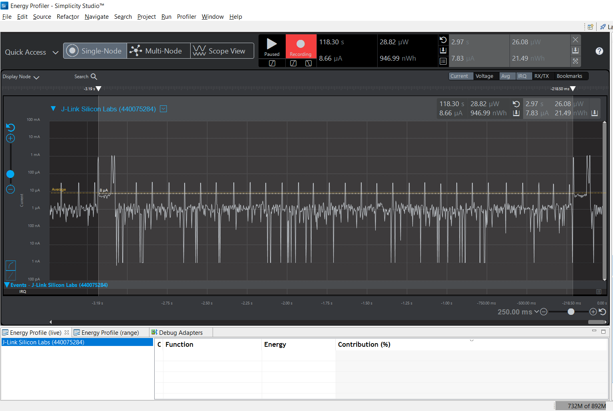
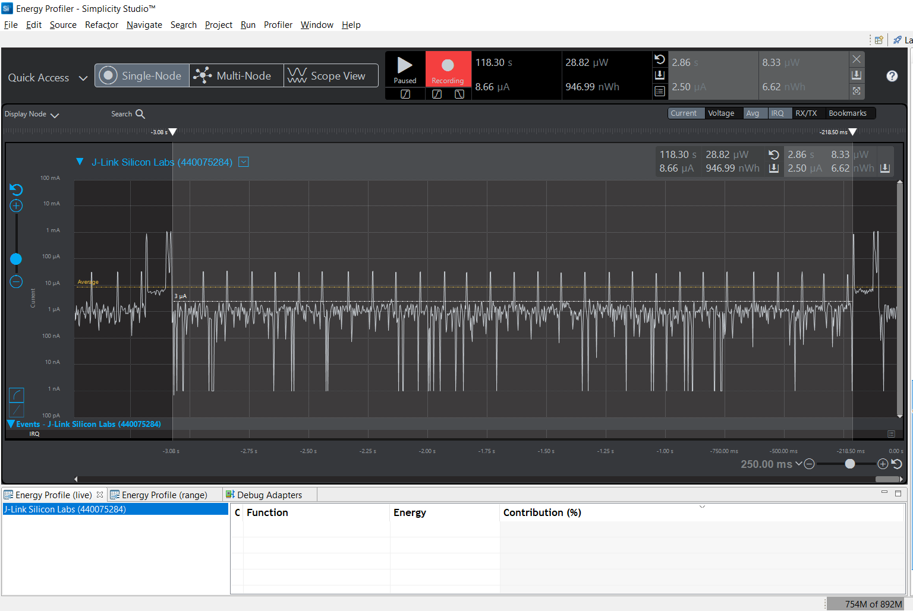
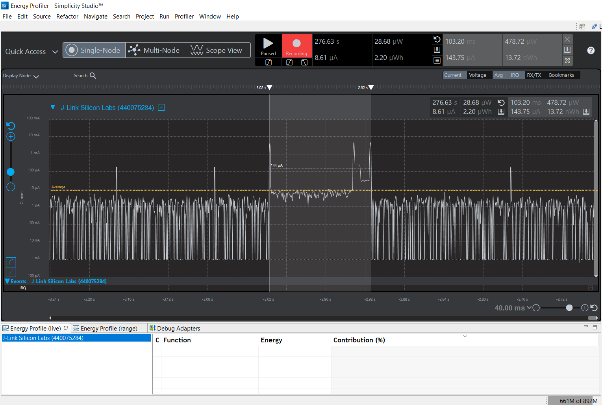

Please include your answers to the questions below with your submission, entering into the space below each question
See [Mastering Markdown](https://guides.github.com/features/mastering-markdown/) for github markdown formatting if desired.

*Be sure to take measurements with logging disabled to ensure your logging logic is not impacting current/time measurements.*

*Please include screenshots of the profiler window detailing each current measurement captured.  See the file Instructions to add screenshots in assignment.docx in the ECEN 5823 Student Public Folder.* 

1. What is the average current per period?
   Answer: 7.83 uA.
    Screenshot:  
     

2. What is the average current when the Si7021 is Powered Off?
   Answer: 2.50 uA.
    Screenshot:  
     

3. What is the average current when the Si7021 is Powered On?
   Answer: 143.75 uA.
    Screenshot:  
     

4. How long is the Si7021 Powered On for 1 temperature reading?
   Answer: 103.20 ms.
    Screenshot:  
     

5. Compute what the total operating time of your design for assignment 4 would be in hours, assuming a 1000mAh battery power supply?  
   Answer: Battery Life = (Capacity/Current Consumption for 1 hr) = 1000/(0.00783 x 20 x 60) = 106.42 hrs.
   
6. How has the power consumption performance of your design changed since the previous assignment?  
   Answer: Power consumption has decreased more than ten-fold since the design in the previous assignment. The average current consumption per period was 178.26 uA.  
   This is mainly due to the difference in the average current consumption when the Si7021 is on. Since the timer delays are non-blocking, the 80 mS sleep and 10.8 mS
   conversion time is in low energy modes (EM3 and EM1 respectively). Here the change is about 1000 times (	4.51 mA vs 143.75 uA).
   
7. Describe how you have tested your code to ensure you are sleeping in EM1 mode during I2C transfers.  
   Answer: The code was run first in EM3 mode, without any add/remove requirements. This did not work as the I2C peripheral does not work in modes under EM1.
   Then I added and removed requirements for EM2 mode. This did not work either. Finally I added and removed requirements for EM1 mode. This ended up working.
   This way, I could conclude that the I2C peripheral works in EM1 mode.  
   Also, the current draw is in about 4.5mA at peak. This is close to the current draw of EM1 mode although a little higher as I think there is an additional draw
   due to the Si7021 sensor and the I2C peripheral actively drawing current.
   

