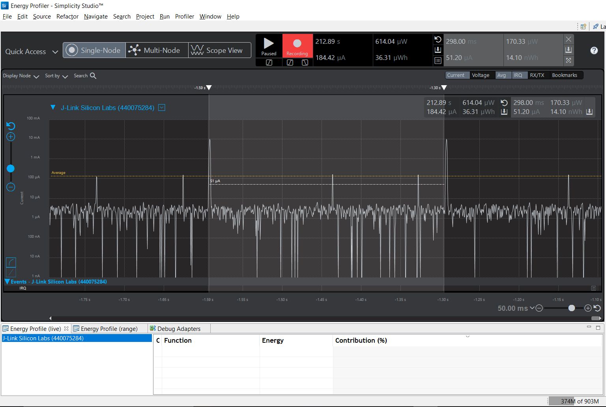

Please include your answers to the questions below with your submission, entering into the space below each question
See [Mastering Markdown](https://guides.github.com/features/mastering-markdown/) for github markdown formatting if desired.

*Be sure to take measurements with logging disabled to ensure your logging logic is not impacting current/time measurements.*

*Please include screenshots of the profiler window detailing each current measurement captured.  See the file Instructions to add screenshots in assignment.docx in the ECEN 5823 Student Public Folder.*

1. Provide screen shot verifying the Advertising period matches the values required for the assignment.
    Screenshot:  253.50mS.
     

2. What is the average current between advertisements?
   Answer: 3.06uA.
    Screenshot:  
     

3. What is the peak current of an advertisement? 
   Answer: 28.13mA.
    Screenshot:  
     

4. Provide screen shot showing the connection interval settings. Do they match the values you set in your slave(server) code or the master's(client) values?.
    Screenshot: 75mS. Yes, they do match as the Client acknowledges the connection parameters required by the Server. (75mS is the connection interval
	and slave latency is 300mS. Most connection events are observed to occur at this time period.
     

5. What is the average current between connection intervals?
   Answer: 1.47uA.
    Screenshot:  
     

6. If possible, provide screen shot verifying the slave latency matches what was reported when you logged the values from event = gecko_evt_le_connection_parameters_id. 
    Screenshot:  Please refer to the last value in the screenshot. (Latency = 3 = 300mS)
   
      

7. What is the peak current of a data transmission when the phone is connected and placed next to the Blue Gecko? 
   Answer: 21.94mA.
    Screenshot:  
     
   
8. What is the peak current of a data transmission when the phone is connected and placed approximately 20 feet away from the Blue Gecko? 
   Answer: 27.81mA.
    Screenshot:  
     
   